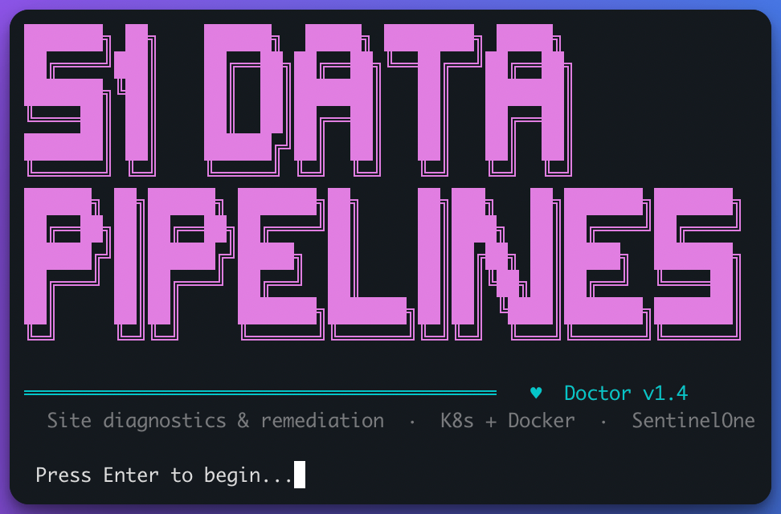
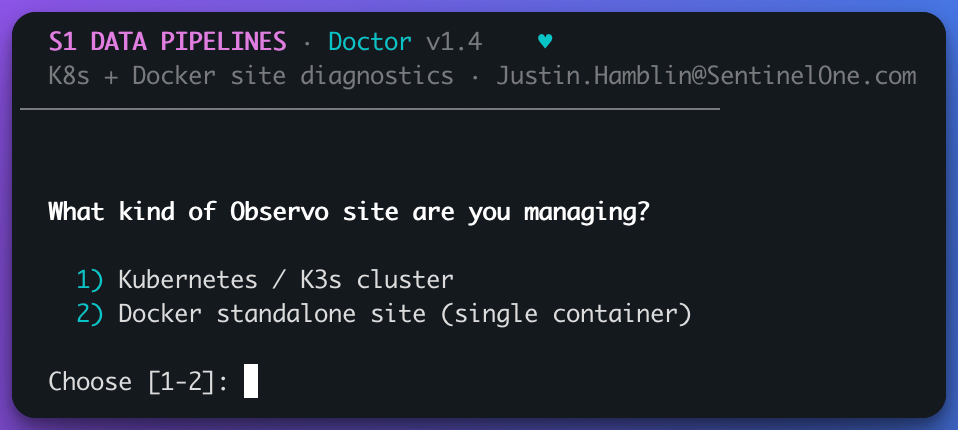
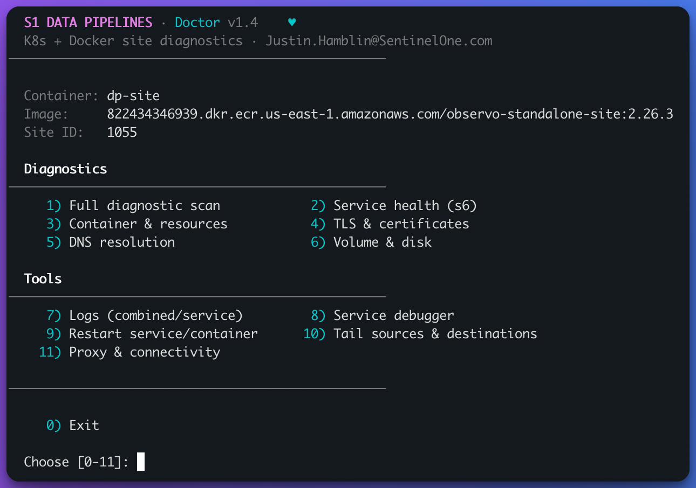
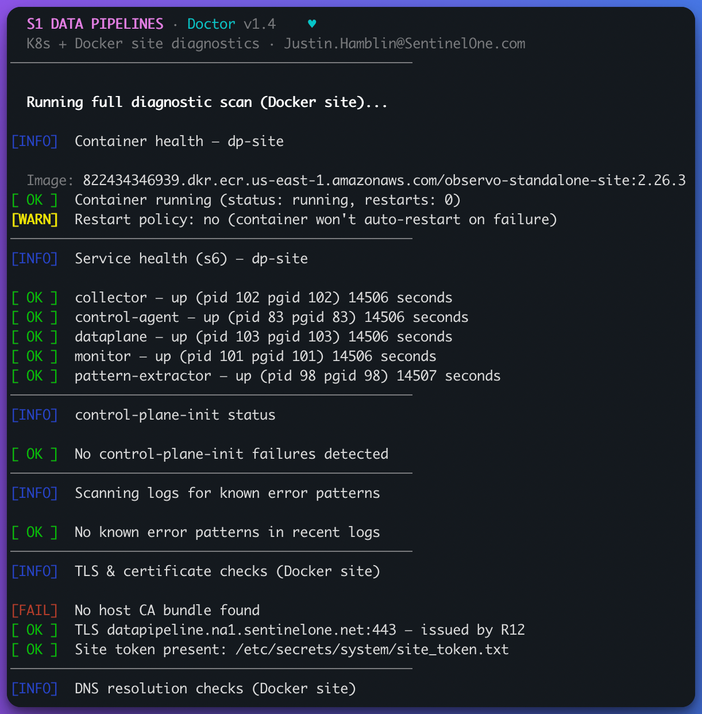
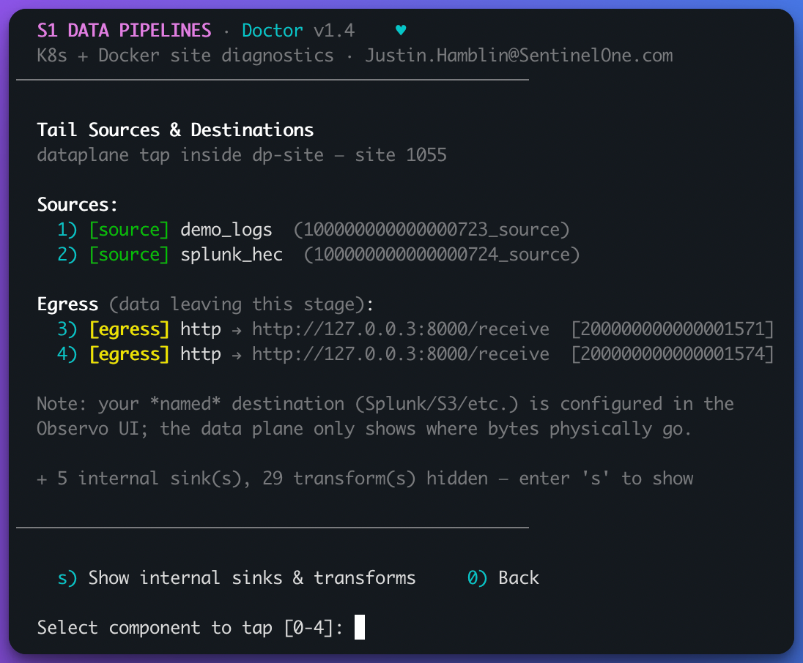
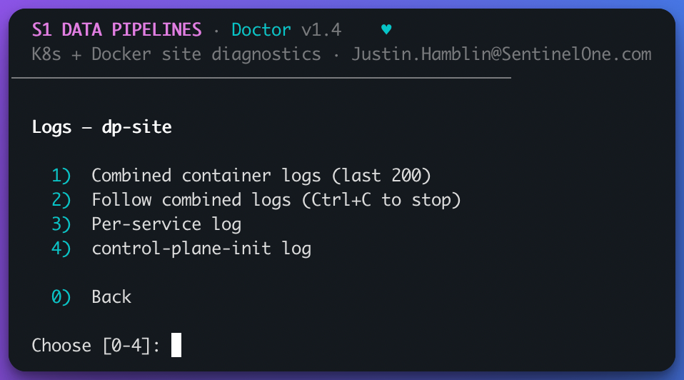

# Data Pipeline Doctor

<p align="center">
  
</p>

Interactive diagnostic and remediation tool for Singularity Data Pipeline site installations — supports both **Kubernetes/K3s** sites and **Docker standalone** sites.

Built by Justin.Hamblin@SentinelOne.com

## Quick Start

```bash
# Copy data-pipeline-doctor.sh to your Data Pipeline node, then:
chmod +x ~/data-pipeline-doctor.sh
./data-pipeline-doctor.sh
```

At startup you'll be asked which kind of site you're managing:

```
  1) Kubernetes / K3s cluster
  2) Docker standalone site (single container)
```

Skip the prompt with `--site-type kubernetes` or `--site-type docker`.

## What It Does

Data Pipeline Doctor diagnoses and fixes common issues with Singularity Data Pipeline site deployments. It provides an interactive menu for troubleshooting whichever deployment model you run.

### Kubernetes / K3s sites

Auto-detects your K3s kubeconfig and inspects pods, nodes, TLS, DNS, PVCs, and resource usage.

### Docker standalone sites

A Docker site is a single container (image `observo-standalone-site`) that runs every Data Pipeline service under an **s6 supervisor** (`control-plane-init`, then `dataplane`, `control-agent`, `collector`, `pattern-extractor`, `monitor`). The tool finds the container automatically, reads its endpoints from the container environment, and checks:

| Check | What it inspects |
|-------|------------------|
| **Full diagnostic scan** | Runs all Docker checks end-to-end and offers fixes |
| **Service health (s6)** | `s6-svstat` for each Data Pipeline service — flags any that are down |
| **control-plane-init** | Reads init logs; detects the retry loop and classifies the root cause (connectivity / TLS / auth). Until init succeeds, the 5 services stay down |
| **Container & resources** | Container state, restart policy, OOMKilled, memory/CPU limits vs live `docker stats` |
| **TLS & certificates** | Host CA bundle, `openssl` to the site's actual endpoints, site-token presence in the container |
| **DNS resolution** | Host and in-container resolution of the site's endpoints |
| **Volume & disk** | `observo-data` volume mount, data-dir writability, Docker storage pressure |
| **Logs** | Combined container logs, per-service s6 logs, control-plane-init log |
| **Service debugger** | s6 status, container env, shell, per-service logs, restart |
| **Tail sources & destinations** | Dataplane source/sink tap from inside the container |
| **Proxy & connectivity** | Host + in-container egress tests and TLS verification to the site's endpoints |

## Screenshots

**Works on both K3s and Docker** — pick your deployment at startup:

<p align="center"></p>

**The Docker site menu** — full diagnostics plus tools for a standalone container:

<p align="center"></p>

**Full diagnostic scan** — container, s6 services, control-plane-init, TLS, DNS and more in one pass:

<p align="center"></p>

**Tail sources & destinations** — live `dataplane tap`, with sources and egress up front and the internal plumbing collapsed:

<p align="center"></p>

**Logs** — combined, follow, per-service, or control-plane-init:

<p align="center"></p>

## Menu Options (Kubernetes)

| # | Option | Description |
|---|--------|-------------|
| 1 | **Full diagnostic scan** | Runs all checks end-to-end and offers to fix any issues found |
| 2 | **Pod health** | Scans all pods for crashes, OOM kills, image pull failures, and known error patterns |
| 3 | **Node health** | Verifies node status, memory/disk/PID pressure conditions |
| 4 | **TLS & certificates** | Tests TLS to the Singularity Data Pipeline cloud endpoints, checks data-plane cert expiry, cert-manager health, CA bundle mount status |
| 5 | **DNS resolution** | Validates CoreDNS, external hostname resolution, in-cluster DNS |
| 6 | **Storage & PVCs** | PVC binding status, StorageClass validation |
| 7 | **Resource usage** | Node and pod CPU/memory usage via metrics-server |
| 8 | **Recent events** | Filterable Kubernetes event viewer (by namespace, warnings only) |
| 9 | **Pod debugger** | Pick a pod and drill into logs, exec, env vars, volumes, resource limits, or scan for known errors |
| 10 | **Restart deployment** | Rolling restart of any deployment in the namespace |
| 11 | **Change namespace** | Switch target namespace for all checks |
| 12 | **Tail sources & destinations** | Live dataplane tap of source/sink components in the data-plane pod |
| 13 | **Proxy & connectivity** | Proxy env detection, endpoint connectivity, TLS verification, CDN token validation |
| 0 | **Exit** | |

## Menu Options (Docker)

| # | Option | Description |
|---|--------|-------------|
| 1 | **Full diagnostic scan** | Runs all Docker checks end-to-end and offers to fix any issues found |
| 2 | **Service health (s6)** | `s6-svstat` for each service (`control-plane-init`, `dataplane`, `control-agent`, `collector`, `pattern-extractor`, `monitor`) |
| 3 | **Container & resources** | Container state, restart policy, OOMKilled, memory/CPU limits vs live `docker stats` |
| 4 | **TLS & certificates** | Host CA bundle, `openssl` to the site's actual endpoints, site-token presence |
| 5 | **DNS resolution** | Host and in-container resolution of the site's endpoints |
| 6 | **Volume & disk** | `observo-data` volume mount, data-dir writability, Docker storage pressure |
| 7 | **Logs** | Combined container logs, per-service s6 logs, control-plane-init log |
| 8 | **Service debugger** | s6 status, container env, open a shell, per-service logs, restart |
| 9 | **Restart service / container** | Restart a single s6 service or the whole container |
| 10 | **Tail sources & destinations** | Live `dataplane tap` — lists Sources, Egress, and (collapsed) internal sinks + transforms |
| 11 | **Proxy & connectivity** | Host + in-container egress tests and TLS verification to the site's endpoints |
| 12 | **Source ports** | Show published ports (annotated by source type) and open a new one for a source — generates the `-p` mapping + recreate command (or recreates for you), plus firewall hints |
| 0 | **Exit** | |

### Opening source ports

A self-hosted site receives source data on **published container ports** (Syslog, HEC, Kafka, …). Docker can't add a published port to a running container, so option **12 → Source ports** opens new ones cleanly:

1. **Shows the currently published ports**, annotated by likely source type.
2. **Pick a preset** (Syslog TCP/TLS/UDP, HEC, Kafka) or **Custom**, then enter the mapping the way you'd write it for `docker -p` — `10001` or `10001:10001`, with an optional `/tcp`/`/udp` (the container port defaults to the host port).
3. **Listener status (informational):** it checks whether anything is already listening on that container port and tells you — but never blocks. Opening the port here and configuring the source in the UI can be done **in either order**.
4. **Apply it two ways:** print the `-p` flag + a full ready-to-run recreate command (env passed via a `chmod 600` `--env-file`, so secrets never hit the command line), **or** have the tool recreate the container for you (it renames the old one as a backup first, with a one-line rollback).
5. **Firewall hints:** prints `ufw` / `firewalld` / `iptables` commands to open the host firewall for the new port.

> The container-side port must match what the source listens on — that listener comes from configuring the source in the SentinelOne UI (e.g. a Syslog source's listen address `0.0.0.0:10001`). This tool opens the host-side plumbing so traffic can reach the container; data flows once both sides are set, in whichever order you do them.
>
> **HEC note:** HEC inputs are usually multiplexed over a single endpoint (the existing `8088`) with per-source tokens, so a new HEC source typically reuses `8088` rather than needing a new port. Open a new port when the source defines its own listener (common for Syslog).

## Auto-Fix Capabilities

### Kubernetes

| Issue | Detection | Fix |
|-------|-----------|-----|
| **TLS CA trust failure** | Container can't verify Singularity Data Pipeline cloud certs (Let's Encrypt ISRG Root X1 / E8 missing from container CA bundle) | Mounts host CA bundle into control-agent init + main containers via `kubectl patch` |
| **Malformed auth token** | control-agent panics with "token contains an invalid number of segments" | Traced to TLS failure above — same fix |
| **Masked init panic** | Init container panicked but reported exit 0 (caused by `tee \| socat` pipe masking exit code) | Detected and flagged; TLS fix resolves root cause |
| **OOMKilled** | Container terminated with OOMKilled reason | Reports current limit, advises increasing in Helm values |
| **Image pull failure** | ImagePullBackOff / ErrImagePull | Checks if imagePullSecrets exist and are valid |
| **RBAC errors** | Forbidden / unauthorized in container logs | Reports ServiceAccount name for investigation |
| **Node pressure** | MemoryPressure, DiskPressure, PIDPressure conditions | Reports condition and suggests host-level checks |

### Docker

| Issue | Detection | Fix |
|-------|-----------|-----|
| **control-plane-init failing** | Init retry loop in logs; classifies connectivity / TLS / auth | Routes to the connectivity/TLS remedy below, then offers a container restart |
| **Connectivity (can't reach control plane)** | `EOF` / refused / timeout to the site's auth endpoint | Shows the required egress and the exact `docker run -e HTTPS_PROXY=…` change, then offers a restart |
| **TLS CA trust** | `certificate signed by unknown authority` | Shows the required `-v <ca-bundle>:…:ro` + `SSL_CERT_FILE` recreate change, then offers a restart |
| **OOMKilled** | `.State.OOMKilled` true | Bumps the limit live via `docker update --memory` (falls back to a recreate command) |
| **Service down** | `s6-svstat` reports a service down | Restart the single service (`s6-svc`) or the whole container |

> A running container's mounts and environment can't be changed in place, so the TLS and proxy fixes show the exact recreate command and offer to restart the container — they don't silently recreate it.

## Troubleshooting

Common issues (from the Data Pipelines FAQ) and where the tool helps. For Docker sites unless noted:

| Symptom | Likely cause | Doctor menu option |
|---------|--------------|--------------------|
| Site shows **Offline** in UI | Container not running, or can't reach the Manager | 2 Service health · 3 Container & resources · 11 Proxy & connectivity |
| **Data not flowing to AI SIEM** | Logs-ingestion egress blocked (firewall/proxy) | 11 Proxy & connectivity (now tests the `…-logs` / `…-metrics` / `…-api` endpoints, not just auth) |
| **control-plane-init failing / services down** | Connectivity or TLS to the control plane | 1 Full scan · 11 Proxy & connectivity (auto-classifies + offers a fix) |
| **TLS handshake failures** | CA not trusted / cert mismatch | 4 TLS & certificates |
| **Connection refused on a source port** | Port not published or host firewall blocking | 12 Source ports (shows mappings, opens new ones + firewall hints) |
| **Events dropped** | Disk queue full / memory exhausted | 6 Volume & disk · 3 Container & resources |
| **High CPU** | Pipeline too complex / throughput over capacity | 3 Container & resources (limits vs live usage) |

## Supported sources & destinations

**Self-hosted source types** (on-prem): Syslog over TCP / UDP / TLS, CEF/LEEF, Kafka consumer, HEC push (Windows Event Forwarding and File tail are post-GA). Cloud sources (Okta, AWS, Azure, GCP, SaaS) use cloud sites, not self-hosted sites.

**Destinations:** SentinelOne AI SIEM (default → Singularity Data Lake), Splunk HEC, Amazon S3. Self-hosted sites can fan out to multiple destinations in one pipeline.

## Sizing (self-hosted site)

| vCPU | RAM | Disk | Approx. throughput |
|------|-----|------|--------------------|
| 2 | 4 GB | 20 GB | ~250 GB/day |
| 4 | 8 GB | 50 GB | ~1–2 TB/day |
| 8 | 16 GB | 100 GB | ~3–5 TB/day |

For higher throughput, deploy multiple sites and partition sources across them.

## Required egress endpoints

A self-hosted site needs outbound **HTTPS (TCP 443)** to the SentinelOne cloud — no inbound connections are required. The exact hosts are read from the container environment; for region `<region>` (e.g. `na1`, `eu1`, `apac1`) they look like:

- `datapipeline.<region>.sentinelone.net` — Manager / auth control plane
- `datapipeline-api.<region>.sentinelone.net` — API gateway
- `datapipeline-logs.<region>.sentinelone.net` — **data ingestion**
- `datapipeline-metrics.<region>.sentinelone.net` — metrics
- the container registry, for image pulls

If your environment uses a corporate proxy, set `HTTPS_PROXY` / `HTTP_PROXY` on the container. The **Proxy & connectivity** check tests every one of these (host-side and from inside the container).

## Requirements

**Kubernetes sites:**
- `kubectl` with access to the cluster
- `helm` (for reading release values and endpoint discovery)
- K3s auto-detected at `/etc/rancher/k3s/k3s.yaml`, or pass `--kubeconfig`

**Docker sites:**
- `docker` CLI with access to the daemon (run as root or join the `docker` group)

**Both:**
- `openssl` (TLS verification), `python3` (optional — formatted output, dataplane tap parsing)

## Usage Examples

```bash
# Interactive mode — asks Kubernetes vs Docker at startup
./data-pipeline-doctor.sh

# Go straight to a Docker site (auto-detects the observo-standalone-site container)
./data-pipeline-doctor.sh --site-type docker

# Target a specific container by name
./data-pipeline-doctor.sh --container dp-site

# Kubernetes with a custom namespace / kubeconfig / release
./data-pipeline-doctor.sh --site-type kubernetes --namespace my-namespace
./data-pipeline-doctor.sh --kubeconfig /path/to/kubeconfig
./data-pipeline-doctor.sh --release my-data-pipeline-release
```

## Known Limitations

- (Kubernetes) The TLS CA trust patch is applied directly to the deployment and will be overwritten on the next `helm upgrade`. After patching, file a ticket with SentinelOne to fix the CA bundle in the container images.
- (Kubernetes) The `global.customVolumeMounts` Helm value does not propagate to init containers in the Data Pipeline Helm chart, which is why the direct `kubectl patch` approach is used.
- (Docker) A running container's environment and mounts can't be changed in place, so the TLS and proxy fixes are advise-and-restart: the tool prints the exact recreate command rather than rebuilding the container for you.
- Some features (formatted output, dataplane tap parsing) require `python3` on the host.
